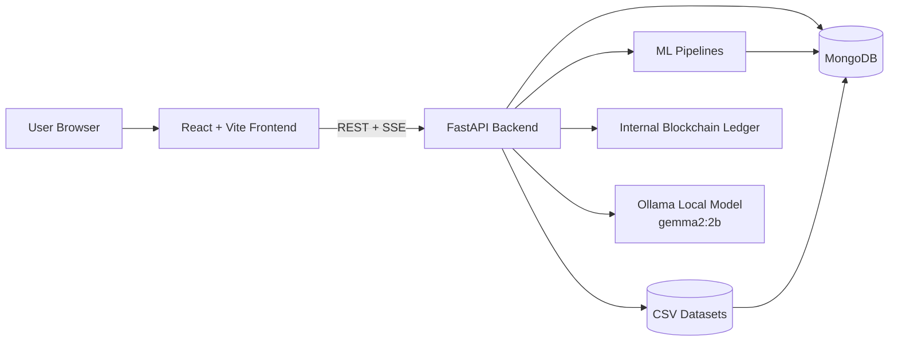
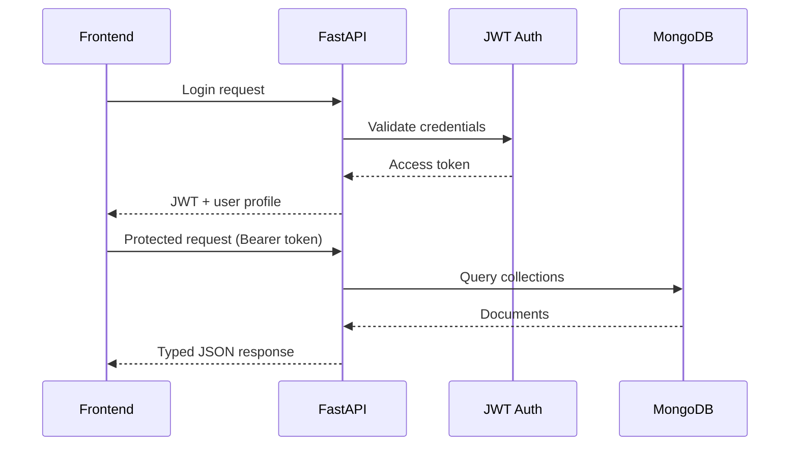
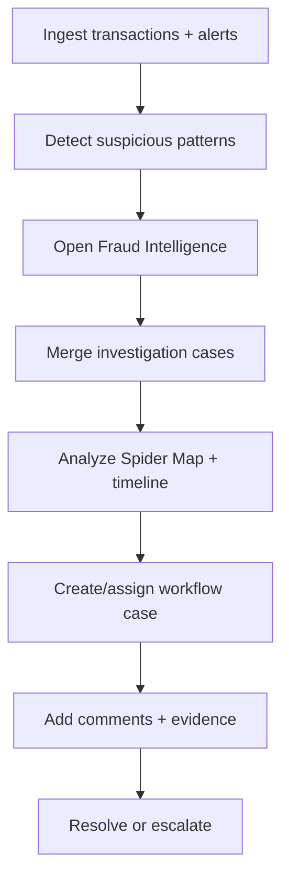
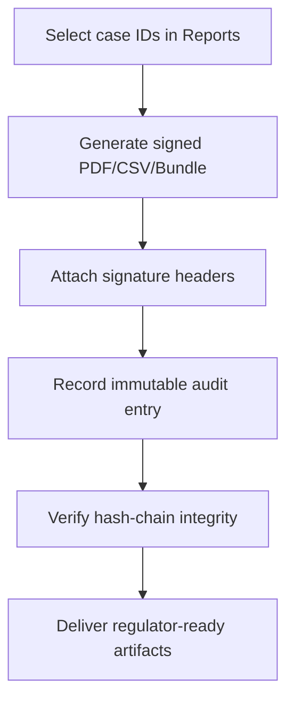
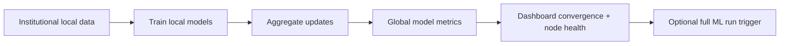

# TrustXAi

AI + Blockchain powered fraud intelligence platform for institutional finance.


## Badges


## Table of Contents

- [Overview](#overview)
- [Key Capabilities](#key-capabilities)
- [Architecture](#architecture)
- [Workflow](#workflow)
- [Frontend Modules and Routes](#frontend-modules-and-routes)
- [Backend API Surface](#backend-api-surface)
- [Tech Stack](#tech-stack)
- [Repository Structure](#repository-structure)
- [Quick Start](#quick-start)
- [Configuration](#configuration)
- [Runbook](#runbook)
- [Demo Accounts](#demo-accounts)
- [Testing and Quality](#testing-and-quality)
- [Troubleshooting](#troubleshooting)
- [Contributing](#contributing)
- [License](#license)

## Overview

TrustXAi is a full-stack fraud intelligence workspace with:

- Role-based dashboards (`admin`, `analyst`, `viewer`)
- Real-time alerts streaming (SSE)
- Fraud investigation graphing and bank-layer spider mapping
- Workflow case management (assign, status, comments, evidence, SLA)
- Signed regulator-ready exports (PDF, CSV, ZIP bundle)
- Immutable audit logs with hash-chain verification
- Federated learning telemetry and ML training orchestration
- Local AI summaries in Reports using Ollama `gemma2:2b`

## Key Capabilities

### Detection and Monitoring

- Live transaction and alert telemetry
- Fraud DNA pattern tracking
- Alert explainability (risk score, model confidence, rule confidence, top factors)

### Investigation and Case Operations

- Case merge, layered money-flow visualization, and timeline replay
- Entity linking by holder attributes (phone, IP, email, bank)
- Investigation workflow actions:
	- create case
	- assign owner
	- update status
	- add comments
	- upload evidence

### Compliance and Governance

- Signed export artifacts:
	- investigation PDF
	- investigation CSV
	- regulator bundle ZIP
- Immutable activity logs and verification endpoint
- Admin telemetry for institutions, threat feed, and audit activity

### ML and Intelligence

- Multi-pipeline training endpoints (`/ml/train/*`)
- Federated learning health and convergence panels
- Local AI report summary generation via Ollama (`gemma2:2b`)

## Architecture

### High-Level System Diagram



### Request Flow



## Workflow

### Fraud Investigation Workflow



### Compliance Export Workflow



### Federated Learning Workflow



## Frontend Modules and Routes

Main application routes:

- Public:
	- `/`
	- `/login`
- Dashboard:
	- `/dashboard/admin`
	- `/dashboard/analyst`
	- `/dashboard/viewer`
- Operations:
	- `/transactions`
	- `/fraud-intelligence`
	- `/alerts`
	- `/reports`
	- `/blockchain`
	- `/federated-learning`
	- `/admin`
	- `/settings`

## Backend API Surface

Base prefix: `/api/v1`

Route groups:

- `/auth`
- `/dashboard`
- `/transactions`
- `/fraud-intelligence`
- `/blockchain`
- `/federated-learning`
- `/ml`
- `/admin`
- `/settings`

Selected high-value endpoints:

### Auth

- `POST /api/v1/auth/login`
- `GET /api/v1/auth/me`

### Fraud Intelligence and Investigation

- `GET /api/v1/fraud-intelligence/dna`
- `GET /api/v1/fraud-intelligence/alerts`
- `GET /api/v1/fraud-intelligence/alerts/stream` (SSE)
- `GET /api/v1/fraud-intelligence/investigation/merge`
- `GET /api/v1/fraud-intelligence/investigation/workflow/cases`
- `POST /api/v1/fraud-intelligence/investigation/workflow/cases`
- `POST /api/v1/fraud-intelligence/investigation/workflow/cases/{id}/assign`
- `POST /api/v1/fraud-intelligence/investigation/workflow/cases/{id}/status`
- `POST /api/v1/fraud-intelligence/investigation/workflow/cases/{id}/comments`
- `POST /api/v1/fraud-intelligence/investigation/workflow/cases/{id}/evidence`
- `GET /api/v1/fraud-intelligence/investigation/audit/logs`
- `GET /api/v1/fraud-intelligence/investigation/audit/logs/verify`
- `GET /api/v1/fraud-intelligence/investigation/reports/export/pdf`
- `GET /api/v1/fraud-intelligence/investigation/reports/export/csv`
- `GET /api/v1/fraud-intelligence/investigation/reports/export/bundle`
- `POST /api/v1/fraud-intelligence/investigation/reports/ai-summary` (Ollama)

### Federated and ML

- `GET /api/v1/federated-learning/model-updates`
- `GET /api/v1/federated-learning/convergence`
- `GET /api/v1/federated-learning/privacy`
- `GET /api/v1/federated-learning/node-health`
- `GET /api/v1/ml/pipelines`
- `POST /api/v1/ml/train/all`
- `POST /api/v1/ml/train/{pipeline_name}`
- `GET /api/v1/ml/train/runs`

### Health and Docs

- `GET /health`
- `GET /docs`
- `GET /openapi.json`

## Tech Stack

### Frontend

- React 18, TypeScript 5, Vite 5
- React Router
- TanStack Query
- Tailwind CSS + shadcn/ui + Radix UI
- Framer Motion
- Recharts
- jsPDF (client-side visual report PDF)
- Vitest + Testing Library

### Backend

- FastAPI, Uvicorn
- PyMongo + mongomock fallback
- JWT auth (`python-jose`) + `passlib`
- Pydantic Settings
- Pandas, NumPy, scikit-learn, statsmodels, networkx, xgboost

### Optional Local AI

- Ollama runtime
- Model: `gemma2:2b`

## Repository Structure

```text
TrustXAi/
	backend/
		app/
			api/endpoints/
			blockchain/
			core/
			db/
			ml/
			schemas/
			main.py
		requirements.txt
		README.md
	data/
	public/
	src/
		components/
		contexts/
		data/
		hooks/
		lib/
		pages/
		test/
	package.json
	README.md
```

## Quick Start

### Prerequisites

- Node.js 18+
- npm 9+
- Python 3.10+
- MongoDB (optional in local development; mongomock fallback exists)
- Ollama (optional, only for local AI summary feature)

### 1) Frontend setup

```bash
cd TrustXAi
npm install
```

Create or update root `.env`:

```env
VITE_API_BASE_URL=http://127.0.0.1:8000/api/v1
```

Start frontend:

```bash
npm run dev
```

### 2) Backend setup

```bash
cd backend
pip install -r requirements.txt
python -m uvicorn app.main:app --reload --host 127.0.0.1 --port 8000
```

Backend docs:

- http://127.0.0.1:8000/docs
- http://127.0.0.1:8000/openapi.json

### 3) Optional local AI setup (Ollama)

```bash
ollama list
ollama pull gemma2:2b
```

The Reports page can call local AI summary after selecting case IDs.

## Configuration

Backend reads environment from `backend/.env`.

Key backend settings:

| Variable | Default | Description |
| --- | --- | --- |
| `API_V1_PREFIX` | `/api/v1` | API base prefix |
| `MONGODB_URL` | `mongodb://localhost:27017` | MongoDB connection string |
| `MONGODB_DB_NAME` | `trustxai` | Database name |
| `CORS_ORIGINS` | localhost values | Allowed frontend origins |
| `DATA_DIR` | `data` | CSV ingestion source |
| `MODEL_ARTIFACTS_DIR` | `backend/model_artifacts` | ML artifacts output |
| `MAX_TRAINING_ROWS` | `0` | Optional row cap (`0` = no cap) |
| `OLLAMA_BASE_URL` | `http://127.0.0.1:11434` | Local Ollama endpoint |
| `OLLAMA_MODEL` | `gemma2:2b` | Local LLM model |
| `OLLAMA_TIMEOUT_SECONDS` | `60` | Ollama request timeout |
| `OLLAMA_MAX_CONTEXT_CHARS` | `12000` | Context truncation guard |

## Runbook

### Typical local development loop

1. Run backend (`uvicorn`) from `backend/`.
2. Run frontend (`npm run dev`) from repository root.
3. Open app at `http://localhost:5173`.
4. Use role accounts to validate role-specific dashboards.
5. Use `Reports` for signed exports and optional local AI summary.

### Data bootstrapping

On backend startup, TrustXAi performs:

1. seed database
2. ingest CSV datasets
3. ensure blockchain genesis block

## Demo Accounts

All seeded users use password: `demo1234`

- `admin@rbi.gov.in`
- `analyst@sbi.co.in`
- `viewer@hdfc.com`

## Testing and Quality

Frontend scripts:

| Command | Purpose |
| --- | --- |
| `npm run dev` | Start Vite dev server |
| `npm run lint` | Lint frontend code |
| `npm run test` | Run Vitest once |
| `npm run test:watch` | Run Vitest in watch mode |
| `npm run build` | Build production frontend |
| `npm run preview` | Preview built frontend |

Backend quick validation:

```bash
cd backend
python -m compileall app
```

## Troubleshooting

### Backend starts but API calls fail

- Verify backend is reachable at `/docs`.
- Confirm frontend `VITE_API_BASE_URL` points to `http://127.0.0.1:8000/api/v1`.

### 401 or auth issues

- Re-login to refresh JWT token in local storage.
- Confirm role allows endpoint (for example viewer cannot access fraud-intelligence workflows).

### Local AI summary not working

- Ensure Ollama daemon is running.
- Confirm model exists: `ollama list` includes `gemma2:2b`.
- Verify `OLLAMA_BASE_URL` and `OLLAMA_MODEL` in backend env.

### CORS issues

- Add your frontend origin to `CORS_ORIGINS` in `backend/.env`.

## Contributing

1. Fork the repository
2. Create a feature branch
3. Commit focused changes
4. Open a pull request

When adding new modules, update this README sections:

- Architecture
- Workflow
- API surface
- Configuration

## License

No license file is currently included. Add a `LICENSE` file to define usage terms.
