# TrustXAi

TrustXAi is a full-stack fraud intelligence platform that combines AI risk analytics, graph-based investigation tooling, and blockchain-style audit integrity for institutional banking workflows.


## Table of Contents

- [What It Does](#what-it-does)
- [Architecture](#architecture)
- [Product Walkthrough (Screenshots)](#product-walkthrough-screenshots)
- [Core Capabilities](#core-capabilities)
- [Tech Stack](#tech-stack)
- [Repository Structure](#repository-structure)
- [Local Setup](#local-setup)
- [Configuration](#configuration)
- [API Surface](#api-surface)
- [ML Pipelines](#ml-pipelines)
- [Demo Accounts](#demo-accounts)
- [Testing](#testing)
- [Deployment](#deployment)
- [Troubleshooting](#troubleshooting)
- [License](#license)

## What It Does

TrustXAi provides a unified operations workspace for:

- Real-time fraud monitoring and triage
- Risk-scored transaction intelligence
- Entity linking and inter-case money trail analysis
- Blockchain-style immutable activity records and verification
- Federated training telemetry and model governance
- Role-based access across admin, analyst, and viewer personas

## Architecture

The platform follows a React frontend + FastAPI backend architecture, with MongoDB persistence and CSV-driven model training pipelines.

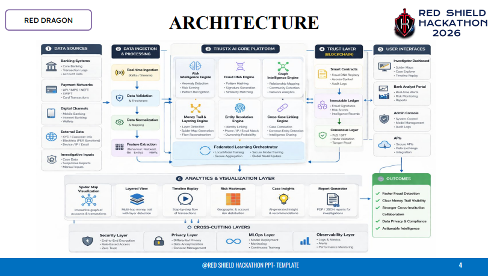

High-level flow:

1. Frontend requests data from FastAPI using JWT auth.
2. Backend serves dashboards, investigation data, and ML telemetry.
3. Startup routines seed users, ingest CSV datasets, and initialize ledger state.
4. Optional local LLM summaries are generated through Ollama.

## Product Walkthrough (Screenshots)

### Landing Page

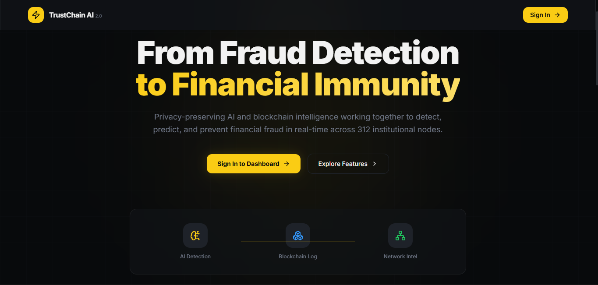

### Login

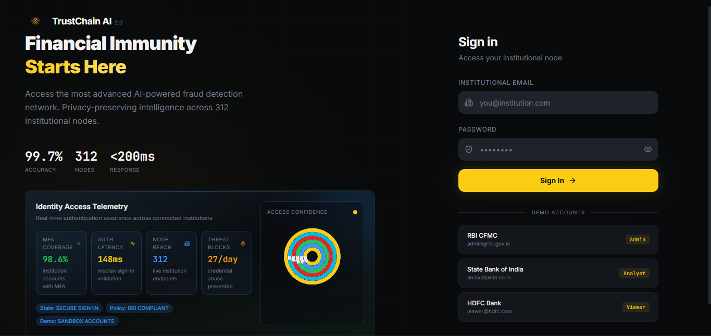

### Analyst Dashboard

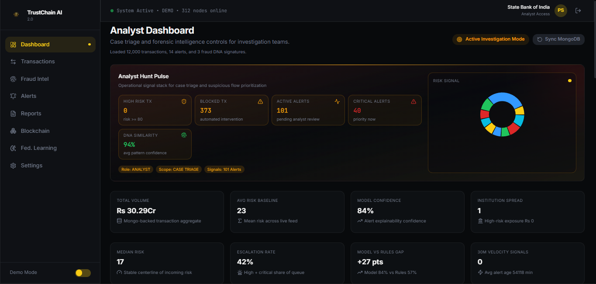

### Transactions

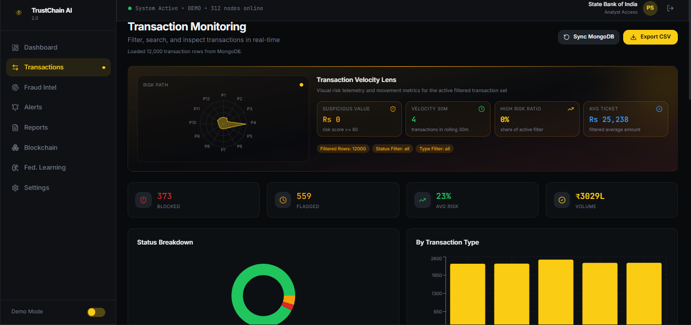

### Fraud Intelligence

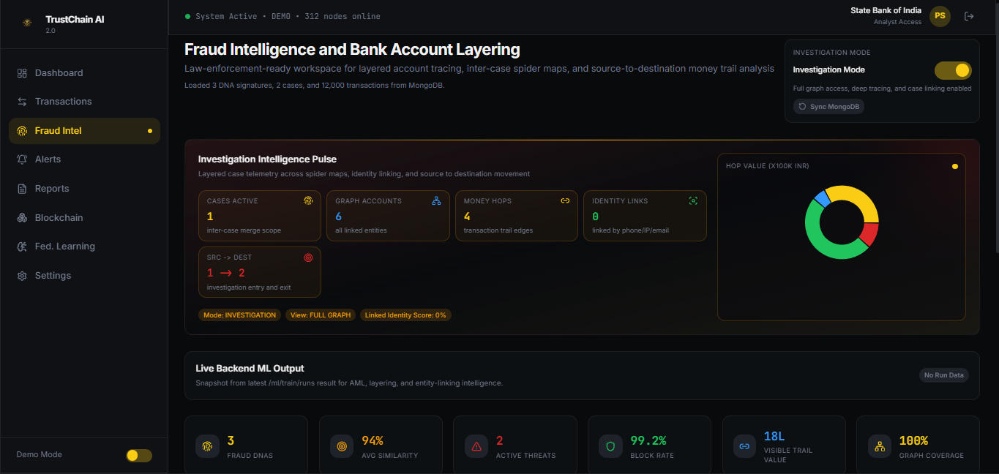

### Money Flow Visualizer

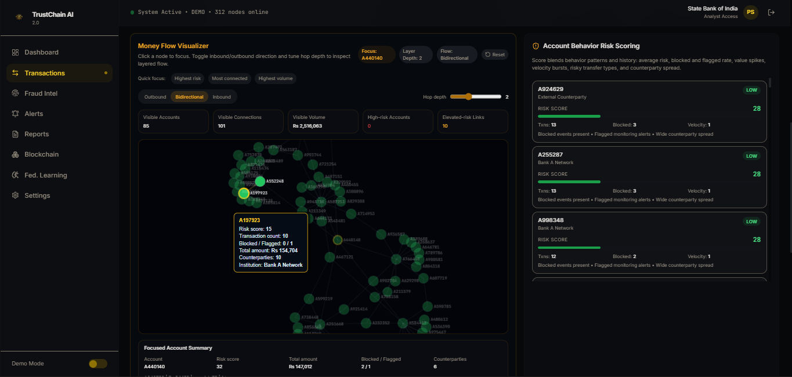

### Bank Account Layering Spider Map

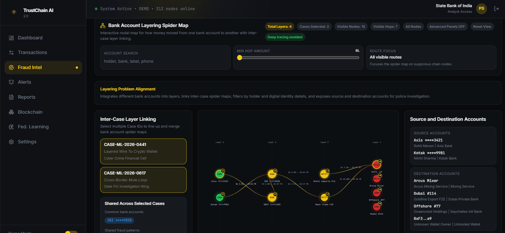

### Reports and Compliance

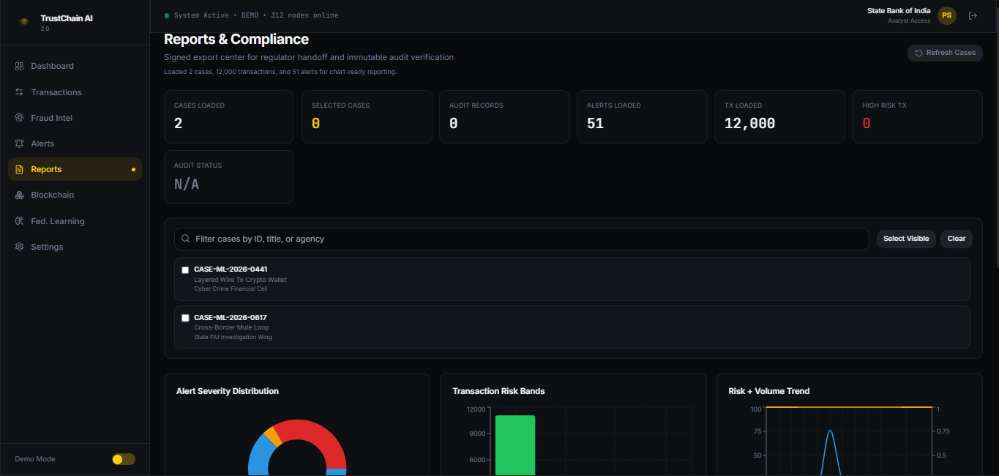

### Blockchain Explorer

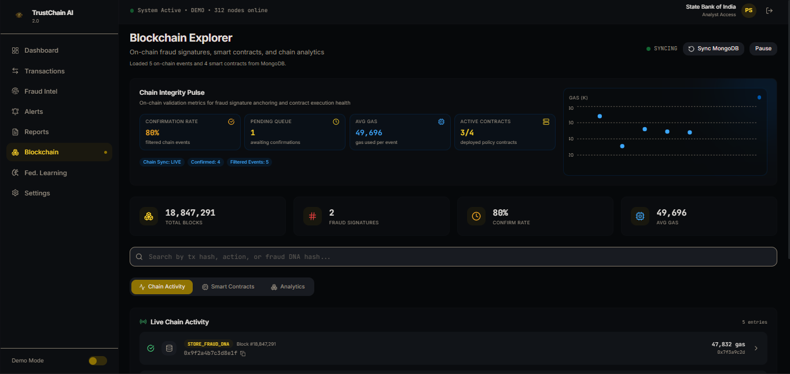

### Federated Learning

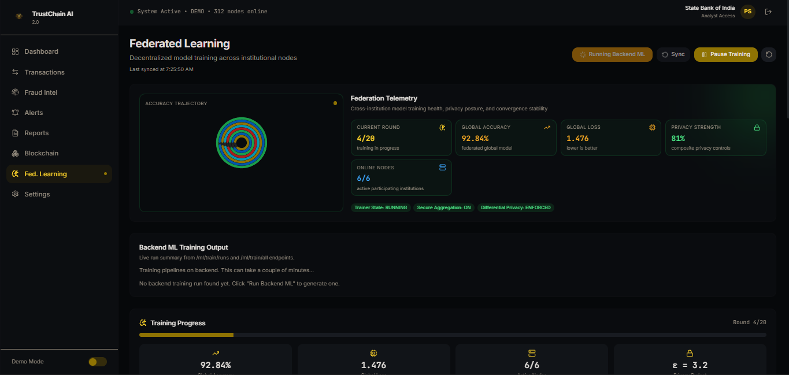

## Core Capabilities

### Detection and Monitoring

- Live dashboard telemetry for transaction and alert volume
- Risk scoring and anomaly surfacing
- Alert enrichment with model and rule confidence

### Investigation Operations

- Cross-case linking and layered money flow trails
- Graph exploration for source-to-destination tracing
- Investigation workflow states, assignment, comments, and evidence

### Governance and Compliance

- Report exports for handoff and review
- Immutable audit chain for record integrity checks
- Role-aware controls by institution and function

### Intelligence and Learning

- Dataset-driven ML pipeline execution
- Federated training visibility and convergence metrics
- Optional local AI report summaries via Ollama

## Tech Stack

### Frontend

- React 18 + TypeScript + Vite
- React Router + TanStack Query
- Tailwind CSS + shadcn/ui + Radix UI
- Recharts + custom visual components

### Backend

- FastAPI + Uvicorn
- PyMongo with mongomock fallback
- JWT auth (`python-jose`) + password hashing (`passlib`)
- Pandas, NumPy, scikit-learn, statsmodels, networkx, xgboost

## Repository Structure

```text
TrustXAi/
  backend/
    app/
      api/endpoints/
      blockchain/
      core/
      db/
      ml/
      schemas/
      main.py
    requirements.txt
    README.md
  data/
  images/
  public/
  src/
    components/
    contexts/
    hooks/
    lib/
    pages/
    test/
  package.json
  README.md
```

## Local Setup

### Prerequisites

- Node.js 18+
- npm 9+
- Python 3.10+
- MongoDB (optional in local mode because mongomock fallback is supported)

### 1) Install frontend dependencies

From repository root:

```bash
npm install
```

### 2) Create Python virtual environment and install backend dependencies

From repository root:

```bash
python -m venv .venv
```

Activate venv:

PowerShell (Windows):

```bash
.venv\Scripts\Activate.ps1
```

Bash (macOS/Linux):

```bash
source .venv/bin/activate
```

Install backend requirements:

```bash
python -m pip install -r backend/requirements.txt
```

### 3) Run backend

```bash
cd backend
python -m uvicorn app.main:app --reload --host 127.0.0.1 --port 8000
```

Backend docs and health:

- http://127.0.0.1:8000/docs
- http://127.0.0.1:8000/redoc
- http://127.0.0.1:8000/health

### 4) Run frontend

In a second terminal from repository root:

```bash
npm run dev
```

Frontend app:

- http://localhost:5173

## Configuration

### Frontend environment

Create or update root `.env`:

```env
VITE_API_BASE_URL=http://127.0.0.1:8000/api/v1
```

### Backend environment

Backend settings are read from `backend/.env`.

| Variable | Default | Purpose |
| --- | --- | --- |
| `APP_NAME` | `TrustXAi Backend` | API display name |
| `API_V1_PREFIX` | `/api/v1` | API prefix |
| `SECRET_KEY` | `change-this-secret-key-in-production` | JWT signing secret |
| `ACCESS_TOKEN_EXPIRE_MINUTES` | `1440` | Token expiry in minutes |
| `ALGORITHM` | `HS256` | JWT algorithm |
| `MONGODB_URL` | `mongodb://localhost:27017` | MongoDB connection string |
| `MONGODB_DB_NAME` | `trustxai` | Database name |
| `CORS_ORIGINS` | localhost list | Allowed origins |
| `DATA_DIR` | `data` | CSV source directory |
| `MODEL_ARTIFACTS_DIR` | `backend/model_artifacts` | ML artifacts output |
| `MAX_TRAINING_ROWS` | `0` | Row limit (`0` means unlimited) |
| `OLLAMA_BASE_URL` | `http://127.0.0.1:11434` | Local Ollama endpoint |
| `OLLAMA_MODEL` | `gemma2:2b` | Local model name |
| `OLLAMA_TIMEOUT_SECONDS` | `60` | LLM request timeout |
| `OLLAMA_MAX_CONTEXT_CHARS` | `12000` | Prompt context limit |

## API Surface

Base prefix: `/api/v1`

Primary route groups:

- `/auth`
- `/dashboard`
- `/transactions`
- `/fraud-intelligence`
- `/blockchain`
- `/federated-learning`
- `/ml`
- `/admin`
- `/settings`

Useful endpoints:

- `POST /api/v1/auth/login`
- `GET /api/v1/auth/me`
- `GET /api/v1/fraud-intelligence/alerts/stream` (SSE)
- `GET /api/v1/ml/pipelines`
- `POST /api/v1/ml/train/all`
- `GET /api/v1/ml/train/runs`

## ML Pipelines

Implemented training pipelines include:

- transactions
- layered_transactions
- entities
- time_series
- complaints
- federated
- aml_patterns
- fraud_detection_financial

Training run endpoints:

- `GET /api/v1/ml/pipelines`
- `POST /api/v1/ml/train/{pipeline_name}`
- `POST /api/v1/ml/train/all`
- `GET /api/v1/ml/train/runs`

## Demo Accounts

All seeded users use password: `demo1234`

- admin@rbi.gov.in
- analyst@sbi.co.in
- viewer@hdfc.com

## Testing

Frontend:

```bash
npm run lint
npm run test
npm run build
```

Backend quick check:

```bash
cd backend
python -m compileall app
```

## Deployment

Recommended deployment split:

- Frontend: Vercel
- Backend: Render

Minimum production checklist:

1. Set strong backend `SECRET_KEY`.
2. Configure production MongoDB URL.
3. Set production `CORS_ORIGINS`.
4. Set frontend `VITE_API_BASE_URL` to deployed backend URL.
5. Validate `/health` and `/docs` after deployment.

## Troubleshooting

### Backend reachable but frontend calls fail

- Confirm frontend `.env` has correct `VITE_API_BASE_URL`.
- Verify backend is running at `http://127.0.0.1:8000`.

### Auth failures

- Re-login to refresh JWT token.
- Confirm route is allowed for your role.

### CORS errors

- Add your frontend origin to `CORS_ORIGINS` in `backend/.env`.
- Restart backend after config changes.

### Slow startup

- First startup may take longer due to seed + CSV ingestion + model artifacts checks.

## License

No license file is currently included in this repository.